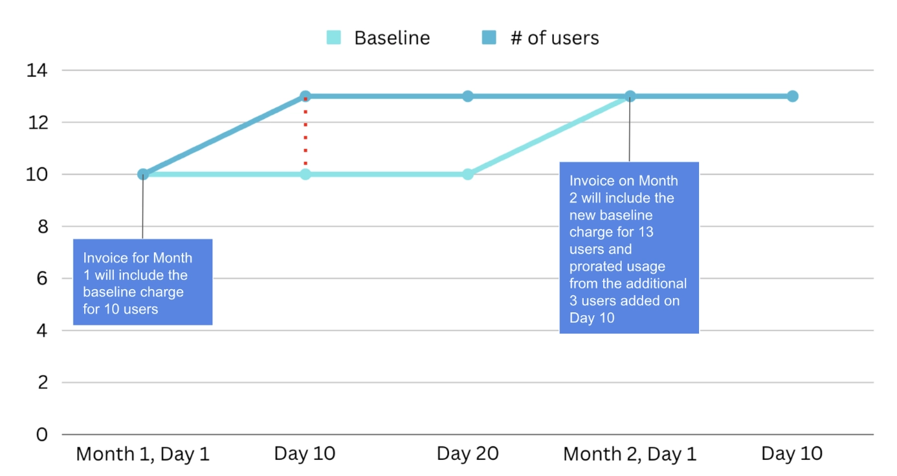
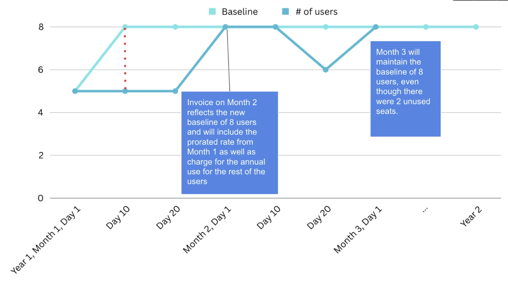
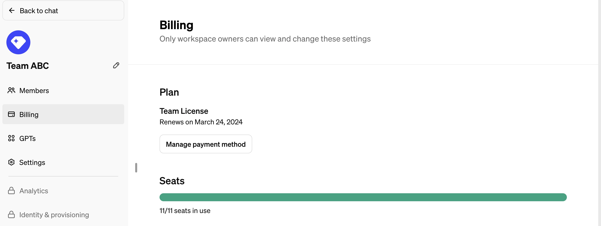
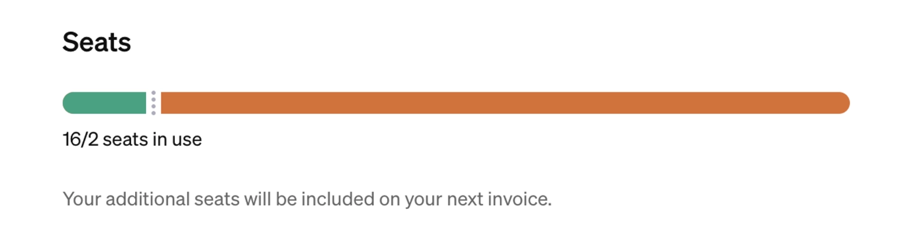
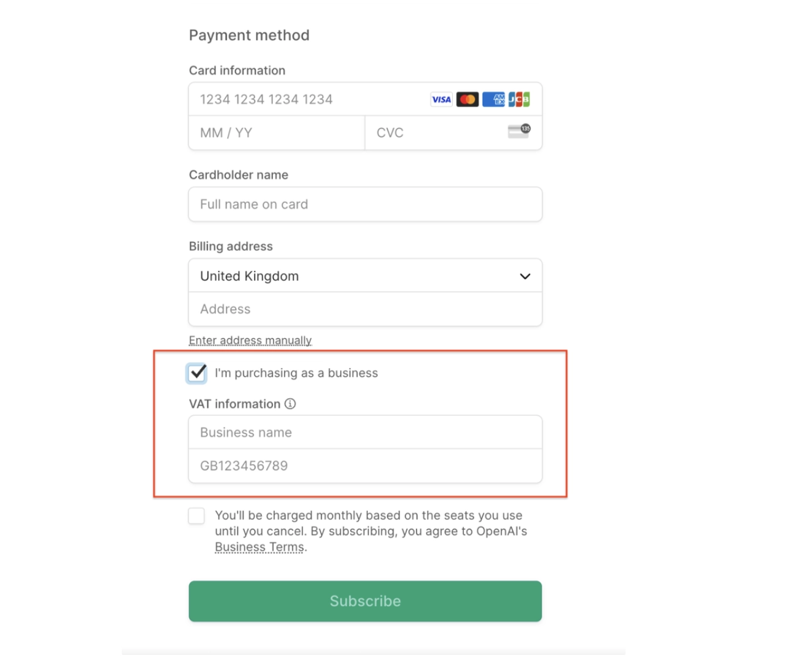
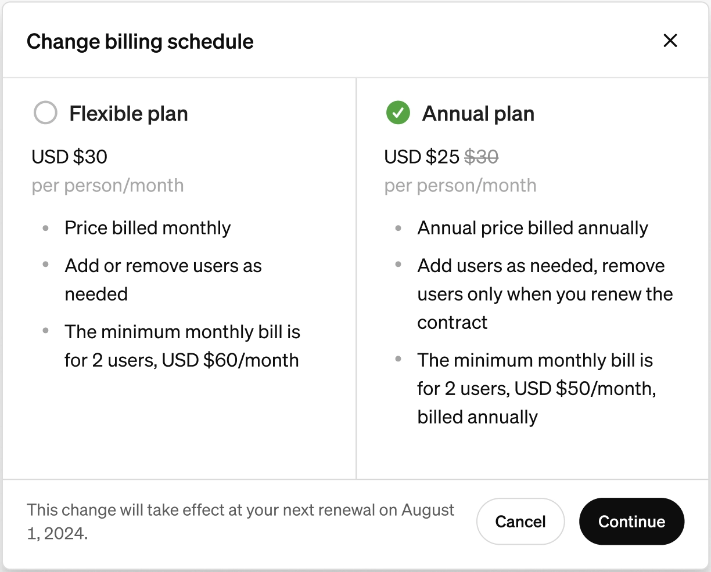

# ChatGPT Business订阅计划：账单管理完全指南

---

你的团队刚上线ChatGPT Business，结果月底账单一来，数字比预期多了30%？或者你在年付和月付之间纠结，不知道哪种更划算？别慌，这篇文章就是来解决这些实际问题的。

ChatGPT Business的计费逻辑确实有点复杂——什么基线席位、按比例计费、真实核算（true-ups）——听起来像财务术语大全。但搞懂这些规则，你就能精准控制成本，避免不必要的支出。接下来我们用人话把这些规则讲清楚，包括怎么注册、怎么选计费方案、怎么调整席位数，以及那些容易踩的坑。

---

## 基础信息：注册和最低要求

想注册ChatGPT Business？直接在你的ChatGPT账户里就能操作，[点这里](https://chatgpt.com/#team-pricing)就行。

有个硬性要求：**最少2个用户**。一个人用不了Business版，这是团队协作产品。

## 两种计费方案：灵活月付 vs 年付计划

ChatGPT Business提供两种计费方式，选哪个取决于你的团队规模是否稳定。

### 方案1：灵活月付（Flexible Plan）

**适合人群：** 团队规模经常变动，或者想先试试水的用户。

**计费逻辑：**
- 每个月初，按你的**基线席位数**（baseline seats）收费
- 月中加人？超出基线的席位**立即**按剩余天数比例扣费
- 下个月初，按当前总席位数收取新一个月的费用

**重点：** 只有超出基线的席位才按比例计费。如果你月中减少席位到基线以下，基线会在下次账单日调整，但**当月还是按原基线收费**。

**举个例子：**
你买了10个席位，每月$30/席位，第一个月账单是$300。
第10天你加了3个席位（现在共13席位）。
下次账单怎么算？

- 新月的13个席位费用：13 × $30 = $390
- 上月多出的3个席位用了20天：3 × (20/30) × $30 = $60
- **总计：$450**

### 方案2：年付计划（Annual Plan）

**适合人群：** 团队规模相对稳定，想省钱的用户（年付价格更便宜）。

**计费逻辑：**
- 年初一次性支付基线席位的全年费用
- 期间加人？每月进行一次"真实核算"（true-up），超出基线的席位按年费比例结算
- 每次核算后，新增席位变成新的基线

**真实核算（True-ups）是什么？**
简单说就是每月月底盘点：你实际用了多少席位，超出基线的部分立即按剩余年份的价格结算。

**触发即时账单的情况：**
- 单次新增席位达到当前基线的**1倍**，或者
- 单次新增**20个席位**

比如你基线是5个席位，某天加了5个用户（刚好1倍），系统会立即发送账单，基线重置为10。

**举个例子：**
你买了5个席位，年费$25/席位/月（总计$1,500）。
第10天加了3个席位（现在共8席位）。
下次账单怎么算？

- 初始年费：5 × $25 × 12 = $1,500
- 第一次月度核算：
  - 本月剩余20天的费用：3 × (20/30) × $25 = $50
  - 未来11个月的费用：3 × $25 × 11 = $825
  - **核算总计：$875**

如果第二个月第20天你移除了2个用户（降到6席位），不会影响计费——因为还在新基线（8席位）以下。

## 能试用吗？

目前不提供试用期。但你可以选**灵活月付方案**，按月订阅随时可以取消，算是变相试用。👉 [如果想更灵活地体验AI工具，不妨看看这个ChatGPT会员方案，按月付费无压力](https://shaoyumi.com/buy/65)。

## 账单管理：在哪里看账单和改支付方式

所有账单管理功能都在**工作区设置（Workspace Settings）**的**账单信息（Billing Info）**标签页里，只有工作区所有者（Owner）能查看。

**你能做什么：**
- 查看历史账单
- 通过"管理计划"（Manage plan）按钮修改信用卡、更新账单信息或取消订阅
- 查看下次账单日期和金额
- 查看当前使用的席位数和超出基线的数量

如果你当前使用的席位超过了基线，账单页面会显示在本期结束前将设定的新基线数量。

## VAT免税申请

如果你在征收增值税（VAT）的地区，可以在结账时填写税号（Tax ID），系统会自动免除VAT，这个设置会应用到所有未来账单。

## 月付和年付能互相切换吗？

可以。工作区所有者可以随时切换。

**操作步骤：**
1. 进入[账单工作区设置](https://chatgpt.com/admin/billing)
2. 点击"管理许可证"（Manage license）
3. 在弹窗中选择"账单周期"（Billing schedule）

选择新的计费周期，点击"继续"。

确认页面会显示下次续订日期——这就是计费周期变更的生效时间。点击"确认"完成。

**注意：** 计费周期变更不会立即生效，要等到下次续订时才执行。

**举两个例子：**
- **月付改年付：** 今天是2024年7月8日，你的月付订阅7月17日续订。如果你改成年付，7月17日仍会续订，但到期日是2025年7月17日（年付），而不是2024年8月17日（月付）。
- **年付改月付：** 今天是2024年7月8日，你的年付订阅9月17日续订。如果你改成月付，9月17日仍会续订，但到期日是2024年10月17日（月付），而不是2025年9月17日（年付）。

## 能减少席位数吗？

可以，但不用手动操作。创建ChatGPT Business计划时会让你指定购买多少席位。如果后来发现用不了那么多，**直接空着不分配就行**——系统会在计费周期结束时自动调整账单，把未使用的许可证扣掉。

## 单次最多能买多少席位？

目前上限是**999个席位**。如果你的团队规模超过这个数，需要联系OpenAI客服。

---

## 总结：选对方案，账单不翻车

ChatGPT Business的计费逻辑初看复杂，但核心就是"基线+按需增补"。月付适合灵活调整的小团队，年付适合规模稳定、想省钱的大团队。搞清楚基线席位、按比例计费和真实核算这几个概念，你就能精准控制成本，避免月底账单暴击。如果你还在犹豫要不要上Business版，或者想找更灵活的AI工具订阅方案，👉 [这个ChatGPT会员特价账号](https://shaoyumi.com/buy/65)或许能帮你省下一笔预算，同时享受稳定的服务体验。
